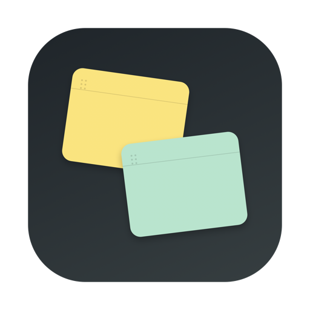

# Deskbit

[简体中文](README.md) · [English](README.en.md)

[Website](https://deskbit.tonyjianchina.chatgpt.site) · [Latest release](https://github.com/tonyjianchina/Deskbit/releases/latest)

<p align="center">
  
</p>

<p align="center">A lightweight, native sticky notes app for macOS.</p>

Keep tasks, ideas, and reminders on your desktop. Each note is an independent window that you can move, pin, select as a group, and arrange automatically. Your notes stay on your Mac and are never uploaded to a server. No account is required.

## Download and install

Download [Deskbit-v1.2.2-macOS-universal.zip](https://github.com/tonyjianchina/Deskbit/releases/download/v1.2.2/Deskbit-v1.2.2-macOS-universal.zip), or visit [Releases](https://github.com/tonyjianchina/Deskbit/releases/latest) for the latest version.

1. Double-click the ZIP file to extract it.
2. Drag `Deskbit.app` into your Applications folder.
3. Open Deskbit from Applications.

> [!IMPORTANT]
> v1.2.2 uses a local ad hoc code signature. It is not signed with an Apple Developer ID or notarized by Apple, so macOS may block it the first time you open it. Try opening it once, then allow it using the steps for your macOS version:
> - macOS 13 or later: Open **System Settings → Privacy & Security**, then click **Open Anyway** in the Security section.
> - macOS 11–12: Open **System Preferences → Security & Privacy → General**, then click **Open Anyway**.
>
> Only do this for a download from this repository.

### Requirements

- macOS 11 Big Sur or later
- An Apple Silicon or Intel Mac

## Interface language

Deskbit v1.2.2 and later provide English and Simplified Chinese translations; a Traditional Chinese translation is not available. On first launch, Deskbit uses the first Chinese or English entry in your macOS preferred languages. All Chinese preferences, including Traditional Chinese, use the Simplified Chinese translation. Other languages are skipped; if neither Chinese nor English appears in the list, Deskbit uses English. The website follows the same language matching rules.

Open Deskbit's menu bar menu and choose **Language → Follow System / English / 简体中文**. Deskbit remembers your choice and updates its interface immediately, with no restart required. Changing the language does not translate or modify your existing notes.

The v1.2.2 download includes both interface languages. No source build is required.

## Features

- Four note colors: yellow, blue, green, and pink
- Bold, bullet lists, and strikethrough using toolbar buttons, keyboard shortcuts, or Markdown
- Nested bullet lists with `•`, `∘`, and `▪` markers
- Drag to select multiple notes on the Finder desktop, then move, pin, or unpin them together
- Automatically arrange all notes or just the selected notes
- Unpinned notes use the normal window level; pinned notes can appear across desktop Spaces
- A menu bar menu for creating, showing, and arranging notes, or quitting the app
- A note history panel for restoring completed notes or deleting them permanently
- Automatic saving of rich text, colors, window positions, and pin status

## How to use

### Note windows

- Drag an empty area of the top bar to move a note.
- Drag a window edge to resize it.
- Click a color dot to change the note's color.
- Click `+` to create a note near the current note on the same display.
- Click the pin to pin or unpin a note.
- Click the checkmark to complete a note and move it to history.
- Click the arrange icon in the top-left corner to arrange notes on the main display, with up to four notes per column.

### Note history

- Each entry shows the original color, a content preview, and the completion time.
- Click **Restore** to return a note to the desktop as a normal, unpinned window.
- Deleting an individual note permanently or clearing all history requires confirmation.
- Open note history from the macOS menu bar. Click outside the list to dismiss it.

### Editing and keyboard shortcuts

Select text to cut, copy, and paste with `⌘X`, `⌘C`, and `⌘V`. Use `⌘A` to select all. These commands are also available in Deskbit's **Edit** menu.

| Action | Button | Shortcut | Markdown |
| --- | --- | --- | --- |
| Bold | `B` in the bottom toolbar | `⌘B` | `**text**` |
| Bullet list | List icon in the bottom toolbar | `⌘⇧8` | Type `- ` or `* ` at the start of a line |
| Strikethrough | Strikethrough icon in the bottom toolbar | `⌘⇧X` | `~~text~~` |
| Increase list indentation | — | `Tab` | — |
| Decrease list indentation | — | `Shift+Tab` | — |

## Data and privacy

- Notes are saved in `~/Library/Application Support/Deskbit/notes.json`.
- Data from older versions is migrated automatically when you first launch a newer version.
- Deskbit has no accounts, cloud sync, ads, or telemetry.
- If you choose to send in-app feedback, the text you enter is sent to the developer through the third-party service FormSubmit. Your notes are not attached automatically. Do not include passwords, identity details, or other sensitive information in your feedback.

Back up your `notes.json` file before upgrading or moving to another Mac.

## Build from source

Install Xcode Command Line Tools, then run:

```bash
git clone https://github.com/tonyjianchina/Deskbit.git
cd Deskbit
./scripts/build-app.sh
open "dist/Deskbit.app"
```

The build script creates `dist/Deskbit.app` as a universal app for Apple Silicon and Intel Macs.

### Run checks

```bash
./scripts/build-app.sh
for test_script in scripts/test-*.sh; do "$test_script"; done
swift build
```

## Project structure

```text
Sources/Deskbit/   App source code
Tests/             Functional check programs
Tools/             Icon generation tools
scripts/           Build and test scripts
```

## Project status

Deskbit is in early testing. Report bugs and suggest features through GitHub Issues.
