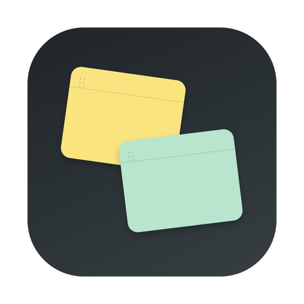

# Deskbit

<p align="center">
  
</p>

<p align="center">一款轻量、原生的 macOS 桌面便签应用。</p>

Deskbit 用来随手记录任务、灵感和备忘。每张便签都是独立窗口，可以自由移动、置顶、批量选择和自动排列。内容只保存在本机，无需账号，也不会上传到服务器。

## 下载与安装

从 [Releases](https://github.com/tonyjianchina/Deskbit/releases/latest) 下载最新的 `Deskbit-v1.0.0-macOS.zip`。

1. 双击 ZIP 解压。
2. 将 `Deskbit.app` 拖入“应用程序”文件夹。
3. 在“应用程序”中打开 Deskbit。

> [!IMPORTANT]
> v1.0.0 是早期试用版，已进行本地代码签名，但尚未经过 Apple Developer ID 签名和公证。首次打开可能被 macOS 拦截。请先尝试打开一次，再按系统版本放行：
> - macOS 13 或更高版本：“系统设置 → 隐私与安全性”，在安全性区域点击“仍要打开”。
> - macOS 11–12：“系统偏好设置 → 安全性与隐私 → 通用”，点击“仍要打开”。
>
> 只应对从本仓库下载的安装包执行此操作。

### 系统要求

- macOS 11 Big Sur 或更高版本
- Apple Silicon 或 Intel Mac

## 主要功能

- 黄色、蓝色、绿色和粉色四种便签配色
- 加粗、项目符号和删除线，支持按钮、快捷键及 Markdown
- 多级项目符号，以 `•`、`∘`、`▪` 区分层级
- 在 Finder 桌面框选多张便签后整组移动、置顶或取消置顶
- 自动排列全部便签，或只排列当前框选的便签
- 未置顶时使用普通窗口层级；置顶后可跨桌面空间显示
- 菜单栏入口，可新建、显示、排列便签或退出应用
- 历史便签面板，可恢复已完成内容或将其永久删除
- 自动保存富文本、颜色、窗口位置和置顶状态

## 使用方法

### 便签窗口

- 拖动顶部导航栏空白区域：移动便签。
- 拖动窗口边缘：调整便签大小。
- 点击颜色圆点：切换便签颜色。
- 点击 `+`：新建便签。
- 点击图钉：置顶或取消置顶。
- 点击对勾：完成当前便签并移入历史。
- 点击左上角排列图标：在主屏幕自动排列，每列最多 4 张。
- 点击左上角历史图标：查看按完成时间倒序排列的历史便签。

### 历史便签

- 每条历史记录显示原颜色、内容摘要和完成时间。
- 点击“恢复”会将便签重新放回桌面，并以普通未置顶窗口打开。
- 单条永久删除和“清空历史”都会在操作前再次确认。
- macOS 菜单栏中也有“历史便签”入口。

### 编辑与快捷键

| 功能 | 按钮 | 快捷键 | Markdown |
| --- | --- | --- | --- |
| 加粗 | 底栏 `B` | `⌘B` | `**文本**` |
| 项目符号 | 底栏列表图标 | `⌘⇧8` | 行首输入 `- ` 或 `* ` |
| 删除线 | 底栏删除线图标 | `⌘⇧X` | `~~文本~~` |
| 增加项目层级 | — | `Tab` | — |
| 减少项目层级 | — | `Shift+Tab` | — |

## 数据与隐私

- 数据保存在 `~/Library/Application Support/Deskbit/notes.json`。
- 旧版数据会在首次启动新版本时自动迁移。
- Deskbit 没有账号、云同步、广告或遥测上报。

建议升级或更换电脑前备份上述 `notes.json` 文件。

## 从源码构建

安装 Xcode Command Line Tools 后执行：

```bash
git clone https://github.com/tonyjianchina/Deskbit.git
cd Deskbit
./scripts/build-app.sh
open "dist/Deskbit.app"
```

构建脚本会生成同时支持 Apple Silicon 和 Intel Mac 的 `dist/Deskbit.app`。

### 运行检查

```bash
for test_script in scripts/test-*.sh; do "$test_script"; done
swift build
```

## 项目结构

```text
Sources/Deskbit/   应用源码
Tests/             功能检查程序
Tools/             图标生成工具
scripts/           构建与测试脚本
```

## 当前状态

Deskbit 目前处于早期试用阶段。可以通过 GitHub Issues 反馈问题或提交功能建议。
